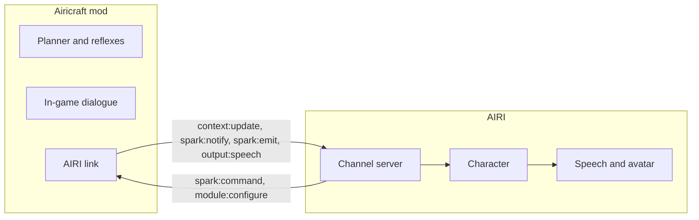

# Airicraft is the Minecraft body of the character

Status: Accepted

## Context

AIRI's Minecraft integration is the Mineflayer bot in `integrations/minecraft`. It connects to the channel server as `minecraft-bot`. Its README marks it for replacement by a Fabric mod runtime.

[Airicraft](https://github.com/proj-airi/airicraft) is that Fabric mod. It runs a complete agent inside the Minecraft client: a planner, reflexes, navigation, perception and in-game chat. It does not need AIRI to work.

## Decision

AIRI is the self of the character. Airicraft is its body in Minecraft.

- AIRI owns the persona, the voice, the avatar and the talk with the user.
- Airicraft owns every action in the game and the chat with other players in the game.
- AIRI sends intentions as `spark:command`. Airicraft executes them with its own planner.
- Airicraft reports state as `context:update`, alarms and milestones as `spark:notify`, and command progress as `spark:emit`.
- AIRI sends the active character card to the mod with `ui:configure`. The server delivers it as `module:configure`.
- Airicraft sends each line that the body says in the game as `output:speech`. AIRI speaks it with the character voice. This event is new.

The mod connects to the channel server as a module named `airicraft`. AIRI opens no new port and starts no new process for it.

## Consequences

- Stage code that recognizes `minecraft-bot` must also recognize `airicraft`.
- The mod does not connect without a channel server token. The settings page must make the token easy to set.
- No provider settings or API keys go to the mod. The mod keeps its own planner model.
- The Mineflayer bot is removed in a later change, after the mod covers the Minecraft panel and the prompt context.
