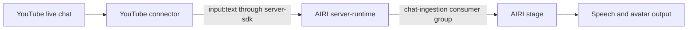

# YouTube live chat connector

Status: WIP design. The connector is not runnable yet. The YouTube client dependency awaits selection.

This integration will receive viewer messages from one YouTube live chat and forward them to AIRI through `@proj-airi/server-sdk`.

## When to use it

Use this integration when AIRI must read and respond to viewers during a YouTube livestream.
The AIRI stage owns model inference, speech, and avatar output.

This integration will not publish messages to YouTube, control OBS, or capture video.

## Proposed flow

The connector will use the existing `input:text` contract. It will preserve the viewer text in `textRaw`.
The message prefix will identify the viewer and YouTube chat. The session ID will isolate each live chat.
YouTube viewer content will remain user input. It must not become system instructions.

## Client decision

The repository instructions require the developer to select a new external library before implementation.

| Option | Benefit | Cost |
| --- | --- | --- |
| Official `streamList` with `@grpc/grpc-js` and Google's protocol | Server pushes new messages; supports a resume token | Requires API credentials and a typed protocol client |
| Official REST API with `@googleapis/youtube` | Existing typed Node client | Polling must obey the server interval and API quota |
| `youtubei.js` | Uses YouTube's InnerTube API | Depends on an unofficial API that can change |

The recommended option is the official streaming API. No dependency is selected or added yet.

Sources:

- [YouTube streaming guide and protocol](https://developers.google.com/youtube/v3/live/streaming-live-chat)
- [YouTube streamList contract](https://developers.google.com/youtube/v3/live/docs/liveChatMessages/streamList)
- [YouTube polling contract](https://developers.google.com/youtube/v3/live/docs/liveChatMessages/list)
- [Google Node API client](https://github.com/googleapis/google-api-nodejs-client)
- [gRPC Node client](https://github.com/grpc/grpc-node)
- [YouTube.js](https://github.com/LuanRT/YouTube.js)

## Implementation requirements

- Connect and authenticate the AIRI SDK before reading live messages.
- Start with text messages from one configured live chat. Skip moderation and membership events explicitly.
- Skip initial chat history by default to avoid a burst of stale replies.
- Deduplicate replayed messages by chat ID and message ID with bounded process-local state.
- Preserve a resume token only after the corresponding batch reaches the SDK transport.
- Treat an SDK send as transport acceptance, not proof of model ingestion or speech.
- Bound retries and pending work. Stop on invalid credentials, missing chat, disabled chat, or ended chat.
- Cancel the YouTube request and retry waits before closing the SDK during shutdown.
- Keep credentials and viewer text out of routine logs.
- Document restart semantics, backpressure, and any possible loss or duplication.

## Verification plan

Use Vitest to verify message routing, history policy, replay suppression, transport failure, reconnects, terminal errors, and shutdown.
Add an integration test with the real server-sdk and a local AIRI server to verify the wire envelope.
Run the workspace typecheck, root typecheck, and repository lint.

A live YouTube-to-AIRI test requires API credentials, an active live chat, and a configured AIRI stage.
Until that test succeeds, report automated tests separately from live proof.

## Setup

Setup commands and configuration will be added after the client decision and executable implementation.
Do not use this directory as a working connector yet.
