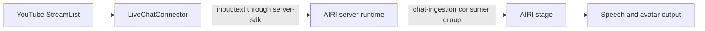

# YouTube live chat connector

Receives viewer text through YouTube's official `liveChatMessages.streamList` gRPC API and forwards it to AIRI with `@proj-airi/server-sdk`.

Status: WIP. Local protocol and AIRI transport tests exist. A live YouTube-to-AIRI speech test is still required.

## When to use it

Use this integration when AIRI must receive viewer messages during a YouTube livestream.
The AIRI stage owns model inference, speech, and avatar output.

Do not use this integration to publish replies to YouTube, control OBS, capture video, or read archived chat.
This version handles one chat per process and forwards text messages only.
It does not process Super Chats, memberships, polls, or moderation events.

## Setup

1. Enable the YouTube Data API v3 in your Google Cloud project and create an API key.
2. Use [`videos.list`](https://developers.google.com/youtube/v3/docs/videos/list) with `part=liveStreamingDetails` to find your active video's `activeLiveChatId`.
3. Install the workspace dependencies from the repository root.

   ```shell
   pnpm install
   pnpm -r --filter @proj-airi/server-sdk... build
   ```

4. Copy the environment template.

   ```shell
   cp integrations/youtube-live-chat/.env.example integrations/youtube-live-chat/.env
   ```

5. Set `YOUTUBE_API_KEY` and `YOUTUBE_LIVE_CHAT_ID` in the new file.
6. Start AIRI desktop, or start server-runtime with an AIRI web stage.
7. Configure the stage's model and speech provider.
8. If the AIRI server requires authentication, set `AIRI_TOKEN` to its token.
9. Start the connector from the repository root.

   ```shell
   pnpm -F @proj-airi/youtube-live-chat start
   ```

10. Post a new text message in the active YouTube chat.

The connector requires an active AIRI chat consumer. Server-sdk connection readiness alone does not prove that a stage can process messages.
Configuration files stay local and are excluded from Git. `.env.local`, when present, overrides `.env`.

## Configuration

| Variable | Default | Meaning |
| --- | --- | --- |
| `YOUTUBE_API_KEY` | Required | Google API key. Sent only as gRPC metadata over TLS. |
| `YOUTUBE_LIVE_CHAT_ID` | Required | Active live-chat ID, not a video or channel ID. |
| `YOUTUBE_INCLUDE_HISTORY` | `false` | Set to `true` to include the recent history returned by YouTube. |
| `YOUTUBE_MAX_RETRIES` | `5` | Maximum consecutive reconnects without cursor progress. Accepts integers from 0 to 20. |
| `AIRI_WS_URL` | `ws://localhost:6121/ws` | AIRI server endpoint. Use `wss` for remote deployments. |
| `AIRI_TOKEN` | Unset | Optional AIRI server token. |

This version supports an API key for YouTube. It does not manage OAuth consent or refresh tokens.
YouTube quotas still apply. The connector uses server push instead of a REST polling loop.

## Message flow



The connector authenticates and announces itself to AIRI before it opens the YouTube stream.
Each forwarded event contains the original text in `text` and `textRaw`.
The message prefix identifies the viewer by display name. Messages use AIRI’s active chat session.
Select a dedicated AIRI conversation before starting if you want separate stream history.
The connector does not create sessions. An invented session ID fails AIRI’s session lookup.
The event ID is `youtube:<liveChatId>:<messageId>`.
Viewer content remains user input and does not become a system instruction.

## History, retries, and delivery

- By default, the connector skips messages published before process startup. It also skips messages without a valid publication time.
- This cutoff applies across initial responses and reconnects. It depends on the host clock, so keep that clock synchronized.
- Only messages from the configured chat with a nonempty text body and message ID are eligible.
- The connector retains the most recent 10,000 accepted message IDs to suppress replay within one process.
- It advances the page token only after each eligible message in the response reaches the SDK transport.
- If a send fails partway through a response, the connector resumes from the prior page token and suppresses recently accepted IDs.
- Retryable gRPC failures are `UNAVAILABLE`, `DEADLINE_EXCEEDED`, `RESOURCE_EXHAUSTED`, and `INTERNAL`. Other status codes stop the connector.
- A stream that returns no response or a failed AIRI connection uses the retry budget. Delays grow from one second to thirty seconds.
- Successful idle streams resume after one second, even with an unchanged cursor. They do not consume the failure retry budget.
- Cursor progress resets the retry budget. Persistent quota or connection failures eventually stop with a nonzero exit code.
- A chat-ended event or `offlineAt` stops the connector. SIGINT and SIGTERM cancel the stream or retry wait before client cleanup.

Delivery is best effort. SDK transport acceptance does not acknowledge stage ingestion, model completion, or audible speech.
There is no durable queue or saved cursor. A restart skips messages published before the new startup time unless history is enabled.
Replays beyond the deduplication window can produce duplicates. A disconnection before the first accepted cursor can miss messages outside YouTube's returned history.

The connector uses the gRPC readable stream's backpressure and retains no separate unbounded message queue.
It does not throttle the model's reply rate or wait for speech completion. High-volume chats need a separate message-selection policy before production use.
Routine logs contain lifecycle messages and sanitized failure summaries, not API keys or viewer text.

## Development and verification

```shell
pnpm -r --filter @proj-airi/server-sdk... --filter @proj-airi/server-runtime... build
pnpm -F @proj-airi/youtube-live-chat typecheck
pnpm -F @proj-airi/youtube-live-chat test
pnpm exec moeru-lint integrations/youtube-live-chat
```

The typecheck generates TypeScript contracts from Google's vendored protocol before compilation.
Generated files stay untracked. Runtime decoding and generation use the same proto-loader options.
The root Vitest configuration includes this integration.

Tests use a local gRPC server for request metadata, protobuf decoding, message filtering, replay handling, retries, and cancellation.
The wire test uses the real AIRI server and SDK, including authentication and consumer registration.
These tests do not prove live YouTube access, model output, or audible speech.

For a live check, run the setup steps with an active chat and configured AIRI stage.
Confirm that a new viewer message reaches AIRI once and produces the expected spoken response.
Then stop the connector and confirm that later viewer messages no longer reach AIRI.

## Protocol source and license

- [Official streaming guide and protocol](https://developers.google.com/youtube/v3/live/streaming-live-chat)
- [StreamList request, response, and error contract](https://developers.google.com/youtube/v3/live/docs/liveChatMessages/streamList)
- [gRPC Node client](https://github.com/grpc/grpc-node)

`proto/stream-list.proto` comes from Google's published sample, retrieved on 2026-09-29, under Apache-2.0. The license is in `proto/LICENSE`.
The local copy adds the missing standard `Duration` import. Field numbers and message names remain unchanged.
